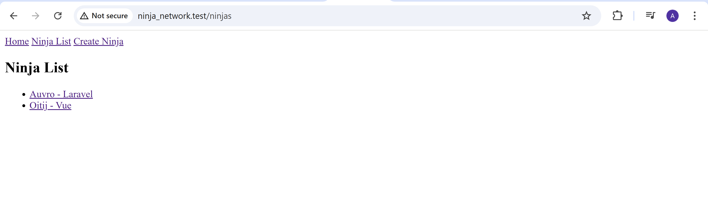
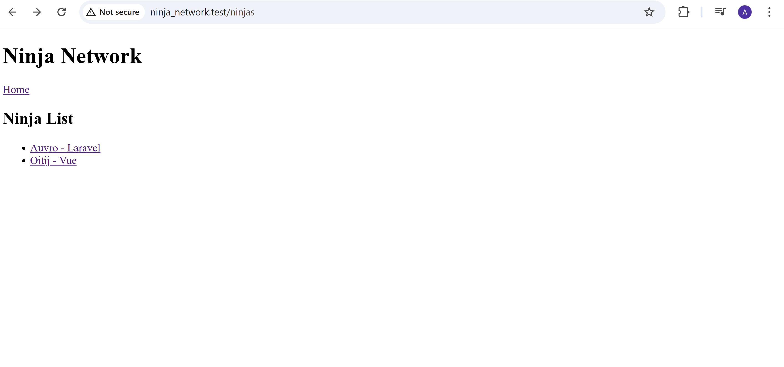
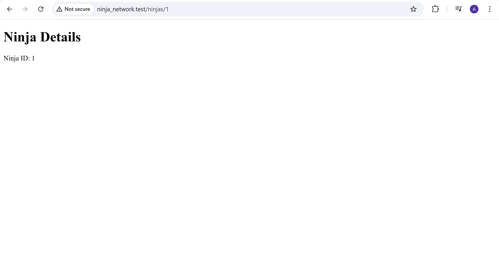

# Laravel Learning Journey - Ninja Network

Learning Laravel fundamentals: **Blade Directives**

## 🚀 Quick Setup

```bash
laravel new ninja_network
```

**Local Development:** `ninja_network.test`





## 🎯 Blade Directives

### Core Directives Used

#### 1. Echo Directive `{{ }}`
Display variables safely (auto-escaped):
```blade
<h1>Welcome to Ninja Network, {{ $name }}</h1>
<p>Ninja ID: {{ $id }}</p>
<a href="/ninjas/{{ $ninja['id'] }}">{{ $ninja['name'] }}</a>
```

#### 2. Foreach Loop `@foreach`
Loop through arrays:
```blade
@foreach($ninjas as $ninja)
    <li>
        <a href="/ninjas/{{ $ninja['id'] }}">
            {{ $ninja['name'] }} - {{ $ninja['skill'] }}
        </a>
    </li>
@endforeach
```

#### 3. Conditional `@if`
Show content based on conditions:
```blade
@if(5 > 2)
    <p>5 is greater than 2</p>
@endif
```

### Other Useful Blade Directives

#### Conditionals
```blade
@if($user->isAdmin())
    <p>Welcome Admin!</p>
@elseif($user->isMember())
    <p>Welcome Member!</p>
@else
    <p>Welcome Guest!</p>
@endif

@unless($user->isPremium())
    <p>Upgrade to Premium!</p>
@endunless
```

#### Loops
```blade
@for($i = 0; $i < 10; $i++)
    <p>Number: {{ $i }}</p>
@endfor

@while($condition)
    <p>Keep looping...</p>
@endwhile

@forelse($items as $item)
    <li>{{ $item }}</li>
@empty
    <p>No items found</p>
@endforelse
```

#### Raw HTML
```blade
{!! $htmlContent !!}  <!-- Unescaped output -->
{{ $safeContent }}    <!-- Escaped output (safer) -->
```

#### Comments
```blade
{{-- This is a Blade comment --}}
<!-- This is an HTML comment -->
```

#### Include Other Views
```blade
@include('partials.header')
@include('partials.sidebar', ['data' => $variable])
```

## �️ Blade Syntax Summary

| Directive | Purpose | Example |
|-----------|---------|---------|
| `{{ }}` | Echo (escaped) | `{{ $name }}` |
| `{!! !!}` | Echo (unescaped) | `{!! $html !!}` |
| `@if/@endif` | Conditionals | `@if($condition)` |
| `@foreach/@endforeach` | Loop arrays | `@foreach($items as $item)` |
| `@for/@endfor` | For loops | `@for($i=0; $i<10; $i++)` |
| `@include` | Include views | `@include('header')` |
| `{{-- --}}` | Comments | `{{-- Comment --}}` |

